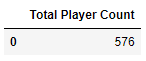
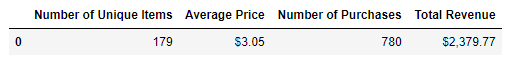
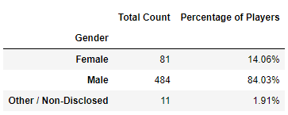
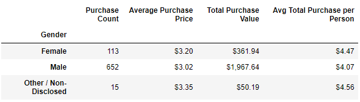
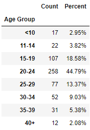
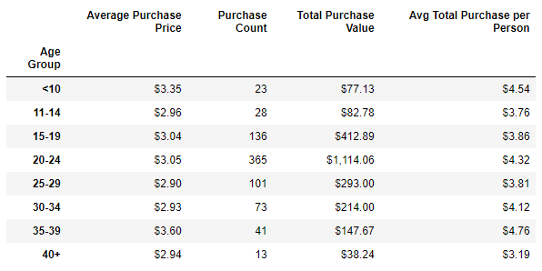
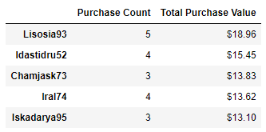
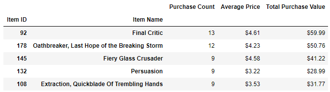
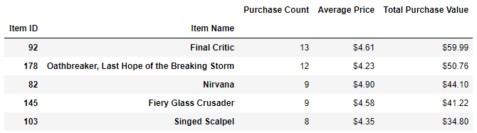

# Heroes of Pymoli Final Analysis

## Observable trends based on the data

- Majority of players are male 84% (484 of 576 players)

- The largest age demographic group (44.79%) are players between 20-24 years old (258 of 576 players)

- Top spenders purchased at least 3 items

- Final Critic was the highest grossing purchase item and the most profitable with 13 total purchases and total purchase value of $59.99

### Player Count

### Purchasing Analysis (Total)

### Gender Demographics

### Purchasing Analysis (Gender)

### Age Demographics

### Purchasing Analysis (Age)

### Top Spenders

### Most Popular Items

### Most Profitable Items

